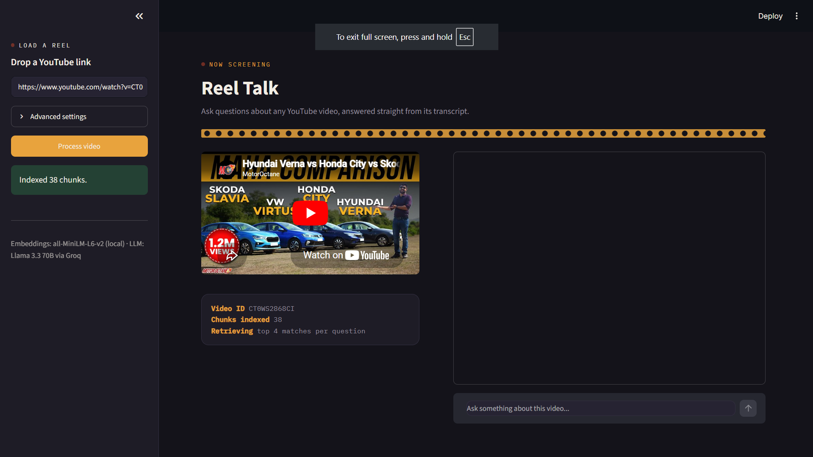
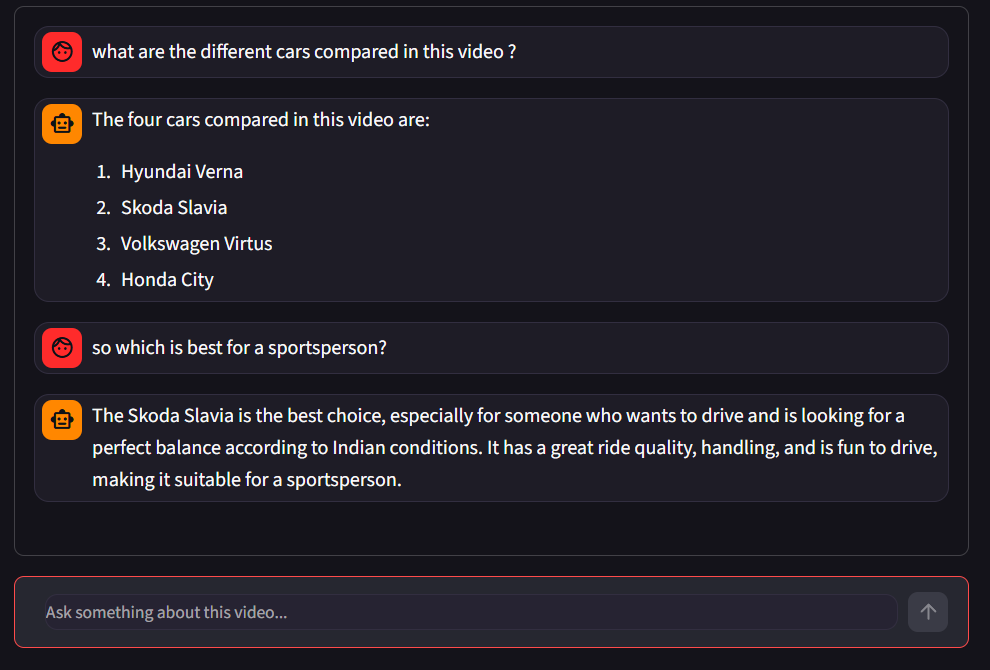

# 🎞️ Reel Talk

Chat with any YouTube video — ask questions and get answers sourced straight from its transcript.

Reel Talk pulls the transcript of a YouTube video, splits it into chunks, embeds them locally, and uses retrieval-augmented generation (RAG) to answer your questions using only what was actually said in the video.

## How it works

1. Paste a YouTube URL and click **Process video**
2. The app fetches the video's transcript via `youtube-transcript-api`
3. The transcript is split into overlapping chunks with `RecursiveCharacterTextSplitter`
4. Chunks are embedded locally using `sentence-transformers/all-MiniLM-L6-v2` and stored in a FAISS vector store
5. Ask a question — the top-k most relevant chunks are retrieved and passed to **Llama 3.3 70B** (via Groq) to generate an answer grounded in the transcript

If the transcript doesn't contain enough information to answer, the model says it doesn't know rather than guessing.

## Tech stack

- **UI:** [Streamlit](https://streamlit.io/)
- **Orchestration:** [LangChain](https://www.langchain.com/) (`langchain-core`, `langchain-community`, `langchain-text-splitters`)
- **LLM:** Llama 3.3 70B via [Groq](https://groq.com/) (`langchain-groq`)
- **Embeddings:** `sentence-transformers/all-MiniLM-L6-v2` (local, via `langchain-huggingface`)
- **Vector store:** [FAISS](https://github.com/facebookresearch/faiss)
- **Transcripts:** [`youtube-transcript-api`](https://github.com/jdepoix/youtube-transcript-api)

## Features

- 🔗 Works with any YouTube URL (`youtube.com/watch?v=...` or `youtu.be/...`)
- ⚙️ Adjustable chunk size, chunk overlap, and number of retrieved chunks (k) in the sidebar
- 💬 Chat-style interface with conversation history per video
- 🎥 Embedded video player alongside the chat
- 🔒 Answers are grounded strictly in the transcript — no hallucinated facts from outside the video
- 🚫 Graceful handling of videos with disabled or missing captions

## Screenshots


## Getting started

### Prerequisites

- Python 3.9+
- A free [Groq API key](https://console.groq.com/keys)

### Installation

1. Clone the repo

   ```bash
   git clone https://github.com/Bunny-777/RAG-chat
   cd RAG-chat
   ```

2. Create a virtual environment (recommended)

   ```bash
   python -m venv venv
   source venv/bin/activate   # On Windows: venv\Scripts\activate
   ```

3. Install dependencies

   ```bash
   pip install -r requirements.txt
   ```

4. Set up your environment variables

   Copy `.env.example` to `.env` and add your Groq API key:

   ```bash
   cp .env.example .env
   ```

   ```env
   GROQ_API_KEY=your_groq_api_key_here
   ```

   > If you skip this step, the app will prompt you for the key directly in the sidebar at runtime.

### Run the app

```bash
streamlit run app.py
```

Then open the URL Streamlit prints (usually `http://localhost:8501`).

## Usage

1. Paste a YouTube link into the sidebar
2. (Optional) Tweak chunk size, chunk overlap, and retrieved chunk count under **Advanced settings**
3. Click **Process video**
4. Once indexing finishes, ask questions about the video in the chat box

## Project structure

```
.
├── app.py              # Main Streamlit application
├── requirements.txt    # Python dependencies
├── .env.example         # Environment variable template
└── README.md
```

## Notes & limitations

- Only works with videos that have captions/transcripts available (auto-generated or manual). Videos with captions disabled will return an error.
- Embeddings run locally on CPU by default (`faiss-cpu`), so initial model load and indexing time depend on your machine.
- The Groq free tier has rate limits — see [Groq's docs](https://console.groq.com/docs) for current limits.


